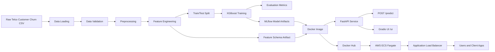

# Telco Churn - End-to-End ML Project

## Purpose

Build and ship a complete machine learning solution for predicting customer churn in a telecom business. The project goes beyond notebook experimentation: it includes data validation, preprocessing, feature engineering, model training, MLflow experiment tracking, a FastAPI prediction service, a Gradio web interface, Docker packaging, CI/CD through GitHub Actions, and deployment-ready infrastructure notes for AWS ECS Fargate behind an Application Load Balancer.

## Problem Solved and Benefits

Customer churn is expensive because retaining an existing customer is usually more cost-effective than acquiring a new one. Telecom companies can use churn prediction to identify customers who are likely to leave and take proactive retention actions.

This project helps solve that problem by:

- Predicting whether a customer is likely to churn based on account, service, billing, and usage-related attributes.
- Making the model available through a REST API so other systems can call it directly.
- Providing a Gradio UI so non-technical users can test customer scenarios without writing code.
- Tracking training runs, metrics, parameters, feature schemas, and artifacts with MLflow.
- Packaging the service into a Docker image for repeatable deployment.
- Supporting production-style deployment through Docker Hub, AWS ECS Fargate, ALB routing, and CloudWatch logging.

## What I Built

- Data pipeline: Loads the Telco Customer Churn CSV, validates required fields and business constraints, and applies preprocessing.
- Data validation: Uses Great Expectations when available, with a pandas-based fallback validation path.
- Feature engineering: Applies deterministic binary encoding and one-hot encoding while saving feature column metadata for serving consistency.
- Model training: Trains an XGBoost classifier with class imbalance handling through `scale_pos_weight`.
- Experiment tracking: Logs parameters, metrics, training time, prediction time, model artifacts, feature columns, and preprocessing artifacts to MLflow.
- Inference pipeline: Loads the MLflow model and applies serving-time transformations that mirror training-time transformations.
- API service: Uses FastAPI and Pydantic to expose `GET /` and `POST /predict`.
- Web UI: Mounts a Gradio app at `/ui` for manual testing and demonstrations.
- Containerization: Uses Docker with Python 3.11 slim, bundles a selected MLflow model artifact, and serves through Uvicorn.
- CI/CD: GitHub Actions builds the Docker image and pushes it to Docker Hub.
- Cloud deployment design: AWS ECS Fargate runs the container, with an ALB forwarding public traffic to the service.

## Project Architecture



## Repository Structure

```text
.
|-- README.md
|-- TECHNICAL_DOCUMENTATION.md
|-- dockerfile
|-- requirements.txt
|-- mlflow.db
|-- notebooks/
|   `-- EDA.ipynb
|-- scripts/
|   |-- run_pipeline.py
|   |-- test_fastapi.py
|   |-- test_pipeline_phase1_data_features.py
|   |-- test_pipeline_phase2_modeling.py
|   `-- prepare_processed_data.py
|-- src/
|   |-- app/
|   |   |-- main.py
|   |   `-- app.py
|   |-- data/
|   |   |-- load_data.py
|   |   `-- preprocess.py
|   |-- features/
|   |   `-- build_features.py
|   |-- models/
|   |   |-- train.py
|   |   |-- evaluate.py
|   |   `-- tune.py
|   |-- serving/
|   |   |-- inference.py
|   |   `-- model/
|   `-- utils/
|       |-- validate_data.py
|       `-- utils.py
`-- .github/
    `-- workflows/
        `-- ci.yml
```

## Dataset

The project is designed around the Telco Customer Churn dataset. Each row represents a customer and includes demographic, service subscription, account, payment, and churn information.

Key input groups:

- Demographics: `gender`, `SeniorCitizen`, `Partner`, `Dependents`
- Phone services: `PhoneService`, `MultipleLines`
- Internet services: `InternetService`, `OnlineSecurity`, `OnlineBackup`, `DeviceProtection`, `TechSupport`, `StreamingTV`, `StreamingMovies`
- Account and billing: `Contract`, `PaperlessBilling`, `PaymentMethod`, `tenure`, `MonthlyCharges`, `TotalCharges`
- Target: `Churn`

The training pipeline expects a CSV path such as:

```text
data/raw/Telco-Customer-Churn.csv
```

The raw dataset is not included in this repository, so it must be provided before rerunning the training pipeline.

## Methodology

### 1. Data Loading

`src/data/load_data.py` loads the raw CSV into a pandas DataFrame and raises a clear `FileNotFoundError` if the file path is missing. This keeps the pipeline explicit and avoids silent failures when data is not available.

### 2. Data Validation

`src/utils/validate_data.py` validates the raw dataset before training.

The validation layer checks:

- Required columns such as `customerID`, `gender`, `Partner`, `Dependents`, `PhoneService`, `InternetService`, `Contract`, `tenure`, `MonthlyCharges`, and `TotalCharges`.
- Allowed categorical values for fields such as `gender`, `Contract`, and `InternetService`.
- Numeric ranges such as `tenure` between 0 and 120 and `MonthlyCharges` between 0 and 200.
- Basic consistency between `TotalCharges` and `MonthlyCharges`.

When Great Expectations is available, the project uses it for richer validation. If it is not available, the project falls back to lightweight pandas checks.

### 3. Preprocessing

`src/data/preprocess.py` performs the initial cleaning needed before feature engineering.

Main preprocessing steps:

- Strips whitespace from column names.
- Drops ID columns such as `customerID`, `CustomerID`, or `customer_id`.
- Converts the target `Churn` from `Yes`/`No` into `1`/`0`.
- Converts `TotalCharges` to numeric, handling blank strings or invalid values.
- Ensures `SeniorCitizen` is an integer field when present.
- Fills numeric missing values with `0`.

This step prepares the raw customer records for deterministic encoding and model training.

### 4. Feature Engineering

`src/features/build_features.py` converts cleaned customer records into model-ready features.

The feature engineering approach is designed to avoid training/serving mismatch:

- Binary categorical features are mapped deterministically.
  - `Yes` -> `1`, `No` -> `0`
  - `Male` -> `1`, `Female` -> `0`
- Multi-category features are one-hot encoded with `drop_first=True`.
- Boolean columns are converted to integers for XGBoost compatibility.
- Feature column metadata is saved so inference can use the exact same column order as training.

The saved production feature schema contains 30 model input columns after encoding.

### 5. Model Training

`scripts/run_pipeline.py` orchestrates the end-to-end training workflow:

1. Set MLflow tracking URI and experiment name.
2. Load the raw CSV.
3. Validate data quality.
4. Preprocess the dataset.
5. Build encoded features.
6. Save processed data locally when the data directory exists.
7. Save feature column metadata.
8. Split the data into train and test sets using stratification.
9. Train an XGBoost classifier.
10. Evaluate the model.
11. Log parameters, metrics, artifacts, and the model to MLflow.

The model uses class imbalance handling:

```text
scale_pos_weight = non_churn_count / churn_count
```

This is important because churn datasets usually contain fewer churned customers than retained customers. Weighting the positive class helps the model pay more attention to churners.

### 6. Classification Threshold

The pipeline uses a custom classification threshold of `0.35` rather than the default `0.50`.

Why this matters:

- Churn detection is often recall-sensitive.
- Missing a likely churner can be more costly than flagging an extra at-risk customer.
- A lower threshold increases sensitivity to churn risk, improving recall while accepting lower precision.

## Model Results

The committed serving model run is:

```text
src/serving/model/3b1a41221fc44548aed629fa42b762e0
```

Saved run parameters:

| Parameter | Value |
| --- | --- |
| Model | XGBoost |
| Test size | 0.2 |
| Threshold | 0.35 |

Saved metrics:

| Metric | Value |
| --- | ---: |
| Data quality pass | 1.0 |
| Precision | 0.4904 |
| Recall | 0.8209 |
| F1 score | 0.6140 |
| ROC AUC | 0.8367 |
| Training time | 0.7085 seconds |
| Prediction time | 0.0044 seconds |

The most important result is the high recall of approximately `0.821`, meaning the model catches a large share of actual churners. This fits the business goal of identifying customers who may need retention action.

## Inference Workflow

`src/serving/inference.py` is responsible for production prediction.

How inference works:

1. Load the MLflow model from `/app/model` in Docker.
2. If `/app/model` is unavailable, fall back to local MLflow or bundled model paths for development.
3. Load `feature_columns.txt` so inference knows the exact model input schema.
4. Convert raw customer JSON into a one-row DataFrame.
5. Coerce numeric columns such as `tenure`, `MonthlyCharges`, and `TotalCharges`.
6. Apply deterministic binary mappings.
7. One-hot encode remaining categorical fields.
8. Reindex to the training feature schema, filling missing columns with `0`.
9. Call the MLflow model.
10. Convert the binary prediction into business language:
    - `1` -> `Likely to churn`
    - `0` -> `Not likely to churn`

This design keeps the training and serving feature spaces aligned, which is one of the most important requirements for reliable ML deployment.

## API Service

The API is defined in `src/app/main.py`.

### `GET /`

Health check endpoint used by local tests and AWS Application Load Balancer health checks.

Response:

```json
{"status": "ok"}
```

### `POST /predict`

Main prediction endpoint.

Example request:

```json
{
  "gender": "Female",
  "Partner": "No",
  "Dependents": "No",
  "PhoneService": "Yes",
  "MultipleLines": "No",
  "InternetService": "Fiber optic",
  "OnlineSecurity": "No",
  "OnlineBackup": "No",
  "DeviceProtection": "No",
  "TechSupport": "No",
  "StreamingTV": "Yes",
  "StreamingMovies": "Yes",
  "Contract": "Month-to-month",
  "PaperlessBilling": "Yes",
  "PaymentMethod": "Electronic check",
  "tenure": 1,
  "MonthlyCharges": 85.0,
  "TotalCharges": 85.0
}
```

Example response:

```json
{"prediction": "Likely to churn"}
```

Implementation note: the trained feature schema includes `SeniorCitizen`, but the current FastAPI and Gradio schemas do not expose it as an input. During inference, missing model columns are filled with `0`, so `SeniorCitizen` defaults to `0` unless the schema is expanded later.

## Web UI

The Gradio interface is mounted directly into the FastAPI app at:

```text
/ui
```

The UI provides dropdowns and numeric inputs for the same customer attributes used by the API. It is useful for:

- Manual testing.
- Demoing churn predictions to non-technical stakeholders.
- Quickly comparing high-risk and low-risk customer scenarios.

## Docker Image

The Docker image packages the application and a selected MLflow model artifact.

The Dockerfile:

- Uses `python:3.11-slim`.
- Installs dependencies from `requirements.txt`.
- Copies the full project into `/app`.
- Bundles the selected MLflow artifacts into `/app/model`.
- Sets `PYTHONPATH=/app/src` for module resolution.
- Exposes port `8000`.
- Starts the app with Uvicorn.

Default bundled model artifact:

```text
src/serving/model/3b1a41221fc44548aed629fa42b762e0/artifacts
```

Build locally:

```bash
docker build -t telco-churn-app .
```

Build with a different MLflow run:

```bash
docker build -t telco-churn-app \
  --build-arg MODEL_RUN_PATH=src/serving/model/<run_id>/artifacts .
```

Run locally:

```bash
docker run -p 8000:8000 telco-churn-app
```

Then visit:

```text
http://localhost:8000/
http://localhost:8000/ui
```

## CI/CD and Deployment

The GitHub Actions workflow is defined in:

```text
.github/workflows/ci.yml
```

On pushes to `main`, the workflow:

1. Checks out the repository.
2. Sets up Docker Buildx.
3. Logs in to Docker Hub using repository secrets.
4. Builds the Docker image.
5. Pushes the image to Docker Hub.

Docker Hub image:

```text
johnny001ds/telco-churn-app:latest
```

The deployment design uses:

- AWS ECS Fargate to run the container without managing servers.
- Application Load Balancer on HTTP port `80`.
- Target Group forwarding to container port `8000`.
- ALB health checks hitting `GET /`.
- Security groups allowing public ALB traffic on port `80` and task traffic on port `8000` from the ALB security group.
- CloudWatch Logs for container logs and ECS events.

## How to Run the Training Pipeline

1. Clone the repository.

```bash
git clone https://github.com/Johnny001-DS/telco-churn-app.git
cd telco-churn-app
```

2. Create and activate a virtual environment.

```bash
python -m venv .venv
source .venv/bin/activate
```

3. Install dependencies.

```bash
pip install -r requirements.txt
```

4. Add the raw dataset.

```text
data/raw/Telco-Customer-Churn.csv
```

5. Run the pipeline.

```bash
python scripts/run_pipeline.py \
  --input data/raw/Telco-Customer-Churn.csv \
  --target Churn
```

6. Optional: view MLflow runs.

```bash
mlflow ui
```

## How to Run the API Locally

Run with Uvicorn:

```bash
python -m uvicorn src.app.main:app --host 0.0.0.0 --port 8000
```

Health check:

```bash
curl http://localhost:8000/
```

Prediction request:

```bash
curl -X POST http://localhost:8000/predict \
  -H "Content-Type: application/json" \
  -d '{
    "gender": "Female",
    "Partner": "No",
    "Dependents": "No",
    "PhoneService": "Yes",
    "MultipleLines": "No",
    "InternetService": "Fiber optic",
    "OnlineSecurity": "No",
    "OnlineBackup": "No",
    "DeviceProtection": "No",
    "TechSupport": "No",
    "StreamingTV": "Yes",
    "StreamingMovies": "Yes",
    "Contract": "Month-to-month",
    "PaperlessBilling": "Yes",
    "PaymentMethod": "Electronic check",
    "tenure": 1,
    "MonthlyCharges": 85.0,
    "TotalCharges": 85.0
  }'
```

Open the UI:

```text
http://localhost:8000/ui
```

## Roadblocks and Fixes

### Unhealthy targets behind the ALB

Cause:

- The load balancer needed a stable health check endpoint.
- Listener and target group port settings had to match the container routing design.

Fix:

- Added `GET /` health endpoint.
- Confirmed ALB listener on port `80` forwards to target group port `8000`.
- Set the target group health check path to `/`.

### Container module import error

Cause:

- The container could not resolve imports under the `src/` directory.

Fix:

- Set `PYTHONPATH=/app/src` in the Dockerfile.
- Used the Uvicorn app path `src.app.main:app`.

### ALB DNS timing out

Cause:

- Security group rules were not aligned with traffic flow.

Fix:

- Allowed inbound HTTP port `80` to the ALB.
- Allowed inbound port `8000` to the ECS task only from the ALB security group.
- Kept outbound rules open where needed for normal service operation.

### ECS deployment not using the newest image

Cause:

- The ECS service was still running an older task image.

Fix:

- Forced a new ECS service deployment after pushing the latest image.
- Added CI/CD support for building and pushing the Docker image consistently.

### Gradio UI could not find model runs

Cause:

- The app expected an MLflow model artifact but could not resolve the correct run path.

Fix:

- Standardized model loading around `/app/model` in Docker.
- Added fallback lookup paths for local development.
- Bundled `feature_columns.txt` and `preprocessing.pkl` with the model artifact.

## Tools and Technologies

- Python 3.11
- Pandas
- NumPy
- Scikit-learn
- XGBoost
- Optuna
- MLflow
- Great Expectations
- FastAPI
- Pydantic
- Gradio
- Uvicorn
- Docker
- GitHub Actions
- Docker Hub
- AWS ECS Fargate
- Application Load Balancer
- CloudWatch

## Future Improvements

- Add `SeniorCitizen` to the FastAPI and Gradio schemas so the UI exposes every trained feature.
- Add automated API tests that run against port `8000` consistently.
- Add a ready-to-run sample payload file for local API testing.
- Store model metadata such as threshold and feature schema in a single versioned artifact.
- Add model monitoring for churn prediction drift after deployment.
- Add a batch scoring job for marketing teams that need churn predictions for many customers at once.
- Add a dashboard for model metrics, churn risk distribution, and top churn drivers.
